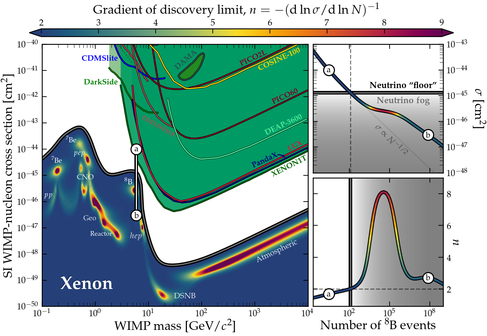

[](https://arxiv.org/abs/2109.XXXX)
[](https://opensource.org/licenses/mit-license.php)

# NeutrinoFog
Code to reproduce the results from my paper arXiv:[2109.XXXX]
---
[](https://github.com/cajohare/NeutrinoFog/raw/master/plots/plots_png/NuFloorExplanation.png)

# Requirements
* [`CMasher`](https://cmasher.readthedocs.io/)
* gfortran (or equivalent f95 compiler, but make sure to edit src/like/Makefile)

# Running the code
The heavy lifting of the likelihood analysis is done in a short fortran program (src/like/like.f95), which can be executed via python. To start, compile the fortran likelihood code by doing
```
make -C src/like
```
Then to run one of the python scripts do e.g.
```
python src/runNuFloor_SI.py Xe
```
using one of the following scrips:
* [`src/runNuFloor_SI.py`](https://github.com/cajohare/NeutrinoFog/tree/main/src/runNuFloor_SI.py) - SI limits
* [`src/runNuFloor_SDp.py`](https://github.com/cajohare/NeutrinoFog/tree/main/src/runNuFloor_SDp.py) - SD (proton) limits
* [`src/runNuFloor_SDn.py`](https://github.com/cajohare/NeutrinoFog/tree/main/src/runNuFloor_SDn.py) - SD (neutron) limits
* [`src/runNuFloor_NuFluxUncertainties.py`](https://github.com/cajohare/NeutrinoFog/tree/main/src/runNuFloor_NuFluxUncertainties.py) - To test the effect of neutrino flux uncertainties

Each takes about 30 minutes per target on my machine, but the resolutions can be lowered to generate them faster.

# Contents
* [`src/`](https://github.com/cajohare/NeutrinoFog/tree/main/src) - Contains python and fortran code to produce the main results
* [`plots/`](https://github.com/cajohare/NeutrinoFog/tree/main/plots) - Contains all the plots in pdf and png formats
* [`notebooks/`](https://github.com/cajohare/NeutrinoFog/tree/main/notebooks) - Jupyter notebooks for plotting results
* [`data/`](https://github.com/cajohare/NeutrinoFog/tree/main/data) - data files, including neutrino fluxes, experimental exclusion limits, and the data produced by this code

# Python modules
* [`WIMPFuncs.py`](https://github.com/cajohare/NeutrinoFog/blob/main/src/WIMPFuncs.py) - Functions needed to calculate WIMP rates
* [`NeutrinoFuncs.py`](https://github.com/cajohare/NeutrinoFog/blob/main/src/NeutrinoFuncs.py) - Functions needed to calculate neutrino rates
* [`Like.py`](https://github.com/cajohare/NeutrinoFog/blob/main/src/Like.py) - Functions for wrapping and running the likelihood code
* [`LabFuncs.py`](https://github.com/cajohare/NeutrinoFog/blob/main/src/LabFuncs.py) - Various utilities
* [`PlotFuncs.py`](https://github.com/cajohare/NeutrinoFog/blob/main/src/PlotFuncs.py) - Plotting functions

# Notebooks
* [`Main.ipynb`](https://github.com/cajohare/NeutrinoFog/blob/main/notebooks/Main.ipynb) - Figures 1 and 3b of the paper
* [`Explanation.ipynb`](https://github.com/cajohare/NeutrinoFog/blob/main/notebooks/Explanation.ipynb) - Figure 2
* [`SI.ipynb`](https://github.com/cajohare/NeutrinoFog/blob/main/notebooks/SI.ipynb) - Figure 3a and S1
* [`SDp.ipynb`](https://github.com/cajohare/NeutrinoFog/blob/main/notebooks/SDp.ipynb) - Figure S2a
* [`SDn.ipynb`](https://github.com/cajohare/NeutrinoFog/blob/main/notebooks/SDn.ipynb) - Figure S2b

---

# If you just want .txt files for the neutrino floors themselves here they are:
## Spin independent
* Xenon: [Xe_SI.txt](https://raw.githubusercontent.com/cajohare/NeutrinoFog/master/data/floors/Xe_SI.txt)
* Germanium: [Ge_SI.txt](https://raw.githubusercontent.com/cajohare/NeutrinoFog/master/data/floors/Ge_SI.txt)
* Argon: [Ar_SI.txt](https://raw.githubusercontent.com/cajohare/NeutrinoFog/master/data/floors/Ar_SI.txt)
* Helium: [He_SI.txt](https://raw.githubusercontent.com/cajohare/NeutrinoFog/master/data/floors/He_SI.txt)
* Fluorine: [F_SI.txt](https://raw.githubusercontent.com/cajohare/NeutrinoFog/master/data/floors/F_SI.txt)
* CaWO4: [CaWO4_SI.txt](https://raw.githubusercontent.com/cajohare/NeutrinoFog/master/data/floors/CaWO4_SI.txt)
* NaI: [NaI_SI.txt](https://raw.githubusercontent.com/cajohare/NeutrinoFog/master/data/floors/NaI_SI.txt)

## Spin dependent (proton)
* Xenon: [Xe_SDp.txt](https://raw.githubusercontent.com/cajohare/NeutrinoFog/master/data/floors/Xe_SDp.txt)
* Germanium: [Ge_SDp.txt](https://raw.githubusercontent.com/cajohare/NeutrinoFog/master/data/floors/Ge_SDp.txt)
* Silicon: [Si_SDp.txt](https://raw.githubusercontent.com/cajohare/NeutrinoFog/master/data/floors/Si_SDp.txt)
* Fluorine: [F_SDp.txt](https://raw.githubusercontent.com/cajohare/NeutrinoFog/master/data/floors/F_SDp.txt)
* NaI: [NaI_SDp.txt](https://raw.githubusercontent.com/cajohare/NeutrinoFog/master/data/floors/NaI_SDp.txt)

## Spin dependent (neutron)
* Xenon: [Xe_SDn.txt](https://raw.githubusercontent.com/cajohare/NeutrinoFog/master/data/floors/Xe_SDn.txt)
* Germanium: [Ge_SDn.txt](https://raw.githubusercontent.com/cajohare/NeutrinoFog/master/data/floors/Ge_SDn.txt)
* Silicon: [Si_SDn.txt](https://raw.githubusercontent.com/cajohare/NeutrinoFog/master/data/floors/Si_SDn.txt)
* Fluorine: [F_SDn.txt](https://raw.githubusercontent.com/cajohare/NeutrinoFog/master/data/floors/F_SDn.txt)
* NaI: [NaI_SDn.txt](https://raw.githubusercontent.com/cajohare/NeutrinoFog/master/data/floors/NaI_SDn.txt)

---

If you need any further assistance or have any questions, contact me at ciaran.aj.ohare@gmail.com. And if you do use anything here please cite the paper, [O'Hare 2021](https://arxiv.org/abs/2109.?????)
```
@article{OHare:2021xxx,
    author = "O'Hare, Ciaran A. J.",
    title = "{Fog on the horizon: a new definition of the neutrino floor for dark matter searches}",
    eprint = "2109.XXXXX",
    archivePrefix = "arXiv",
    primaryClass = "hep-ph",
    month = "9",
    year = "2021"
}
```
